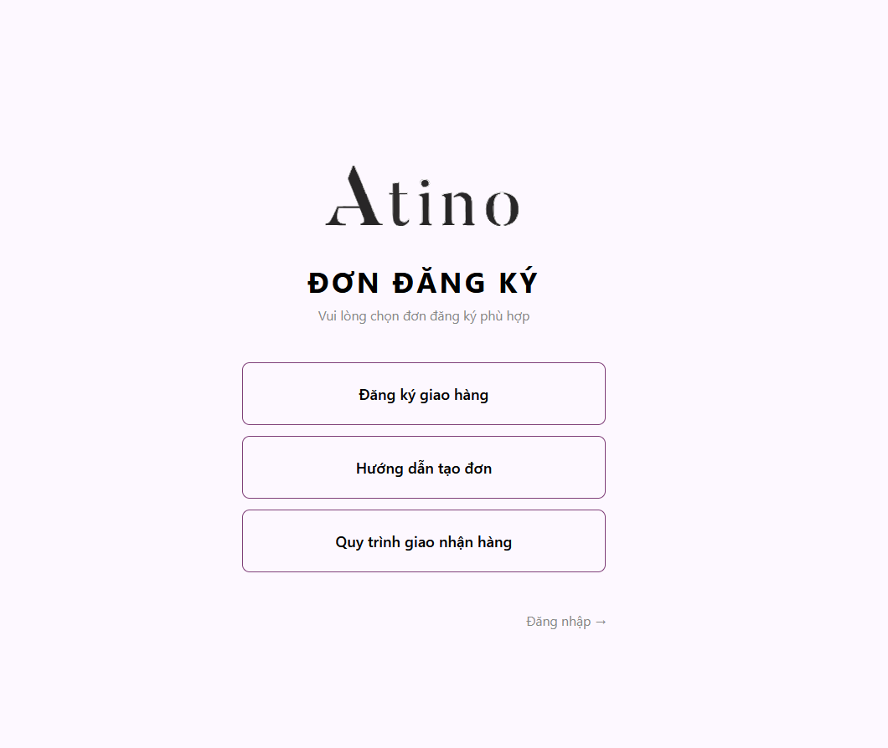
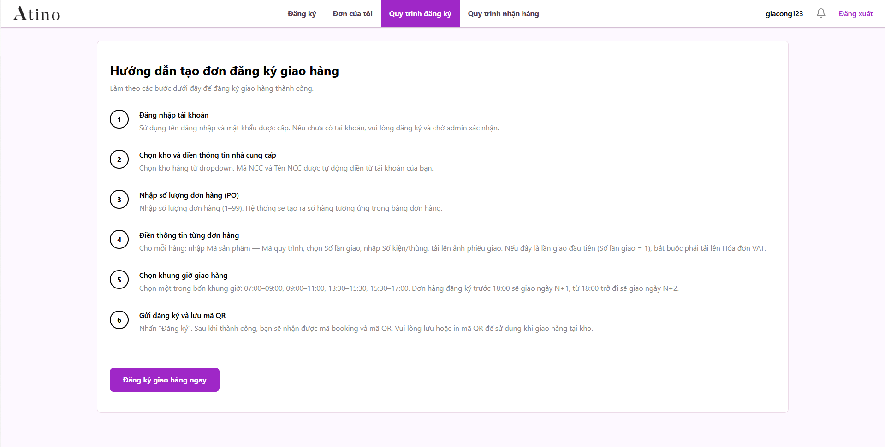
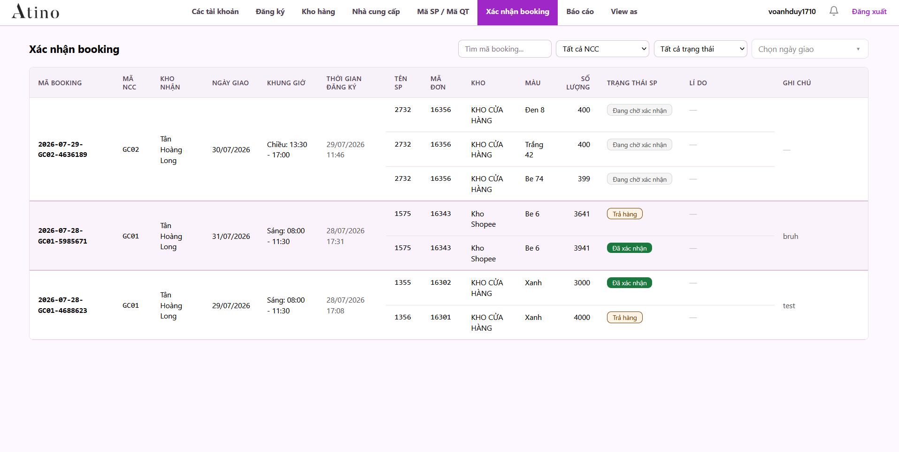

# [Atino Booking Webapp](https://giacong.atino.vn/)

[](https://nodejs.org/)
[](https://react.dev/)
[](https://www.typescriptlang.org/)
[](https://tailwindcss.com/)
[](https://expressjs.com/)
[](https://supabase.com/)
[](https://cloud.google.com/storage)
[](https://vitest.dev/)

An enterprise delivery booking and warehouse intake management web platform built for Atino distribution logistics, coordinating suppliers (NCC), warehouse reviewers, on-site receivers, and operations management in real time.

---

## Features

- **Supplier Delivery Booking** (PO line-items, size matrix & round tracking)
- **Smart Warehouse Capacity Engine** (20,000 items/day ceiling & 17:30 cutoff logic)
- **Gate Intake & QR Scanner** (Camera check-in & physical count reconciliation)
- **Warehouse Intake Verification** (Granular line-item approval workflows)
- **Digital Document Archive** (VAT invoice & delivery slip uploads to GCS)
- **Role-Based Access Control** (Supplier, Reviewer, Receiver, Admin)
- **ERP & Platform Integrations** (Nhanh.vn sync, Lark alerts & Supabase RLS)
- **Operations & Reporting** (Volume analytics & one-click Excel exports)

---

## Preview








---

## Quick Start

### 1. Prerequisites
- [Node.js](https://nodejs.org/) (v18.0 or higher recommended)
- `npm` or `pnpm`
- Supabase project credentials
- Google Cloud Storage service account (for document uploads)

### 2. Clone and Install Dependencies
```bash
git clone https://github.com/voanhduy1710/Atino-booking-webapp.git
cd Atino-booking-webapp
npm install
```

### 3. Configure Environment Variables
Copy the example environment file and fill in your project credentials:
```bash
cp .env.example .env
```

### 4. Run Locally
Start the development servers:
```bash
# Start Vite frontend dev server (http://localhost:5173)
npm run dev

# Start Express backend API (http://localhost:3001)
npm run server:dev
```
Open [http://localhost:5173](http://localhost:5173) in your browser.

---

## PowerShell Helper Scripts

For Windows developers, automated PowerShell workflows are provided in the repository root:

- **`.\deploy_local.ps1`**: Kills conflicting port processes, installs dependencies (if missing), validates environment, and launches both frontend (port 5173) and Express backend (port 3001) in a single terminal.
- **`.\clean_restart.ps1`**: Forcefully terminates lingering Node processes, clears dev ports (5173, 5174, 3001), clears the Vite cache, and restarts a fresh local development environment.
- **`.\deploy.ps1`**: Complete production deployment pipeline that runs typechecks, linting, tests, builds the production frontend, builds the Docker image to Google Cloud Artifact Registry, and deploys to Google Cloud Run.

---

## Testing & Code Quality

```bash
# Run unit tests via Vitest
npm test

# Run tests in interactive watch mode
npm run test:watch

# Run Playwright end-to-end tests
npm run test:e2e

# Run fast linter checks
npm run lint

# Check TypeScript types across frontend and backend
npm run typecheck

# Build production bundle
npm run build
```

---

## Project Structure

```text
Atino-booking-webapp/
├── public/                     # Static brand assets and preview images
├── server/                     # Express backend source code
│   ├── config/                 # Capabilities & storage configuration
│   ├── etl/                    # Nhanh product ETL synchronization scripts
│   ├── lib/                    # GCS, JWT, Supabase, and resilient fetch helpers
│   ├── routes/                 # Express API routes (auth, booking, receiver, etc.)
│   └── index.ts                # Server entry point
├── src/                        # React frontend source code
│   ├── app/                    # Routing, providers, and main application entry
│   ├── features/               # Feature-based domain modules
│   │   ├── accounts/           # User management
│   │   ├── admin/              # Admin dashboard & reports
│   │   ├── auth/               # Login, registration, role guards
│   │   ├── booking/            # Supplier booking form & confirmation
│   │   ├── home/               # Public landing & user guides
│   │   ├── notifications/      # Notification panels
│   │   ├── productProcess/     # Product process catalog
│   │   ├── supplier/           # Supplier management views
│   │   └── warehouse/          # Reviewer & receiver workflows
│   └── shared/                 # Shared UI components, hooks, utilities, and types
├── supabase/                   # Supabase migrations and database schema
├── Dockerfile                  # Production container definition
├── deploy.ps1                  # Production deployment script (Google Cloud Run)
├── deploy_local.ps1            # Local dual-server launcher script
├── clean_restart.ps1           # Developer environment reset script
└── package.json                # Project metadata and dependencies
```
