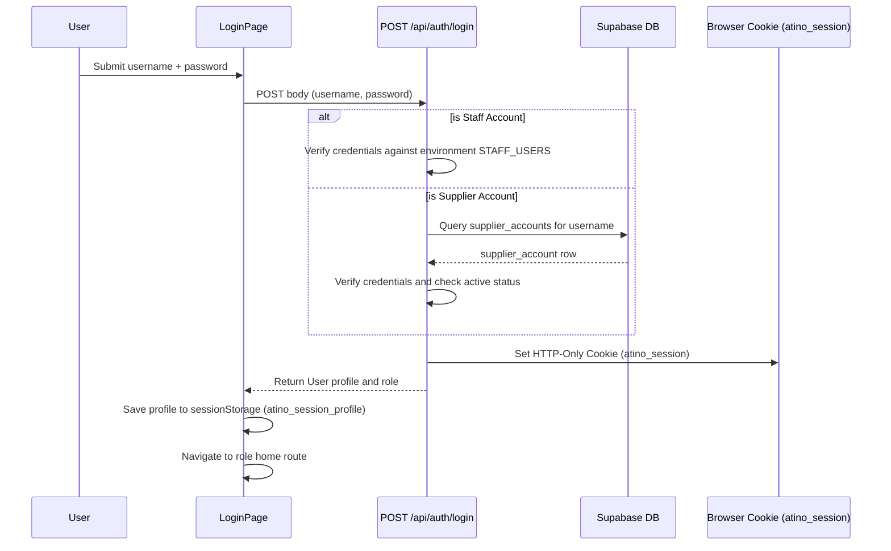

# Auth, Supplier Accounts, and Permissions Architecture

This document describes the design of authentication, session management, and supplier account administration within this project.

The implementation is split across:
- Frontend route map: [routes.tsx](file:///c:/Atino-booking-webapp/src/app/routes.tsx)
- Login UI page: [index.tsx](file:///c:/Atino-booking-webapp/src/features/auth/index.tsx) and form [LoginForm.tsx](file:///c:/Atino-booking-webapp/src/features/auth/components/LoginForm.tsx)
- Frontend role guard: [RequireRole.tsx](file:///c:/Atino-booking-webapp/src/features/auth/guard/RequireRole.tsx)
- Frontend auth/session storage: [auth.ts](file:///c:/Atino-booking-webapp/src/shared/lib/auth.ts)
- Account management page: [AccountsPage.tsx](file:///c:/Atino-booking-webapp/src/features/auth/AccountsPage.tsx) and component [AccountManagement.tsx](file:///c:/Atino-booking-webapp/src/features/accounts/AccountManagement.tsx)
- Backend auth controller: [auth.ts](file:///c:/Atino-booking-webapp/server/routes/auth.ts)
- Backend accounts controller: [accounts.ts](file:///c:/Atino-booking-webapp/server/routes/accounts.ts)
- Backend auth middleware/guard: [httpAuth.ts](file:///c:/Atino-booking-webapp/server/lib/httpAuth.ts)
- Password utility: [password.ts](file:///c:/Atino-booking-webapp/server/lib/password.ts)
- Password vault utility: [accountPasswordVault.ts](file:///c:/Atino-booking-webapp/server/lib/accountPasswordVault.ts)
- In-memory session store: [sessionStore.ts](file:///c:/Atino-booking-webapp/server/lib/sessionStore.ts)
- Roles and Capabilities: [capabilities.ts](file:///c:/Atino-booking-webapp/server/config/capabilities.ts)

---

## Route Map

Frontend routing is defined in [routes.tsx](file:///c:/Atino-booking-webapp/src/app/routes.tsx).

- `/login` renders `LoginPage`
- `/accounts` renders `AccountsPage` containing `AccountManagement` (restricted to the `admin` role)
- Protected pages are wrapped by the `Guard` component which references `ROUTE_PERMISSIONS` in [permissions.ts](file:///c:/Atino-booking-webapp/src/shared/config/permissions.ts) and uses [RequireRole.tsx](file:///c:/Atino-booking-webapp/src/features/auth/guard/RequireRole.tsx):
  - If a user tries to access a protected route without authorization, they are redirected to `/login`.
  - Roles defined in the app include `admin`, `warehouse_reviewer`, `warehouse_receiver`, `manager`, and `supplier`.

---

## User Types and Lifecycle

All user accounts (both staff and suppliers) are migrated to live database tables in Supabase for dynamic management, except for the primary system administrator.

### 1. Staff Accounts
- **Superadmin**: Only the core superadmin `voanhduy1710` remains statically defined in the `.env` file configuration (via the `AUTH_USERS` environment variable) as a bootstrap admin backup.
- **Other Staff (Reviewers, Receivers, Managers)**: Migrated out of the environment file and stored in the database `staff_accounts` (or `auth_accounts`) table in Supabase.
- **Roles**: `admin`, `warehouse_reviewer`, `warehouse_receiver`, and `manager`.
- **Role Assignment**: Assigned dynamically in the database via user-role mapping tables, mapping user accounts to system roles.
- **Authentication**: Backend verifies credentials against the database password hash.

### 2. Supplier Accounts
- **Storage**: Persisted in the `supplier_accounts` database table in Supabase.
- **Role**: `supplier` (every account in this table is scoped as a supplier).
- **Status Lifecycle**:
  - `active`: Fully authorized to submit bookings and view the dashboard.
  - `disabled`: Authorization revoked. Login attempts will return a "Forbidden" HTTP error status.
  - `deleted`: Soft-deleted status. Excluded from normal active listings.
- **Account Management**: Admin creates and updates supplier accounts manually, resets passwords, toggles active/disabled status, deletes accounts, or imports them in bulk via Excel files. There is **no self-registration/signup page**.

---

## Login and Session Hydration

- **Authentication Session**: The backend issues a signed JWT containing claims (`sub`, `username`, `role`, and optional `supplier_id`/`supplier_account_id`).
- **Token Storage**: The JWT is returned via a secure `Set-Cookie` header (`atino_session`, HttpOnly, SameSite=Strict, Max-Age=8 hours). The token is never stored in `localStorage` in the browser.
- **Profile Storage**: The frontend stores the decoded token details (user profile) in `sessionStorage` (`atino_session_profile`) via [auth.ts](file:///c:/Atino-booking-webapp/src/shared/lib/auth.ts) to display the active username/role and support quick routing checks.
- **Session Revocation**: Active sessions are checked in the in-memory session store [sessionStore.ts](file:///c:/Atino-booking-webapp/server/lib/sessionStore.ts). Changing password or disabling an account calls `revokeSessionsForSubject()` which invalidates the session immediately.

---

## Password Vault and Security

To allow admins to assist suppliers, the application implements a reversibly encrypted **Password Vault**:
1. When an account is created or its password is modified, the backend:
   - Hashes the password using `bcrypt` and writes it to `password_hash`.
   - Encrypts the raw password string via AES-256-GCM using `encryptActualPassword()` from [accountPasswordVault.ts](file:///c:/Atino-booking-webapp/server/lib/accountPasswordVault.ts) and writes it to `password_ciphertext`.
2. Admin users can request to view a supplier's password:
   - Call `POST /api/accounts/:accountId/reveal-password`.
   - The backend decrypts the ciphertext using the vault key and returns it.
   - The UI reveals the password for exactly 30 seconds before clearing it from local state.
3. Every critical administrative event (reveal password, update, delete, reset) triggers an audit insert into the `account_audit_events` table via `audit()` in [accounts.ts](file:///c:/Atino-booking-webapp/server/routes/accounts.ts).

---

## Account Management (/accounts)

This interface is used by administrators to list, search, filter, create, update, and bulk-import system accounts (both staff and suppliers). It utilizes a modal-based design featuring role columns and filter controls:

### 1. Filters & Search Controls
At the top of the interface, administrators can filter accounts using:
- **Search input**: Filters account entries dynamically by matching usernames or display names.
- **Role dropdown filter**: Filters the table listing by a specific assigned role (e.g. *Giám Đốc*, *TCKT*, *Sản xuất*, *Kho*, etc.).
- **Status dropdown filter**: Filters the table listing by account lifecycle status (*All*, *Active*, *Disabled*).
- **Accounts counter**: Displays the total count of accounts currently matching the selected filters.

### 2. Action Headers
- **+ Add Account**: Opens a modal popup form to create a new user account (staff or supplier).
- **Excel Bulk Import**: Includes a file selector to upload spreadsheet files (`.xlsx` or `.xls`) to import multiple accounts at once.

### 3. Modal-based Editor
Creating or editing an account opens a modal dialog:
- **Form Fields**: Username, Password, Display Name, Status (Active/Disabled), and Role (dropdown).
- **Submission**:
  - Validates inputs using backend schema validation.
  - Generates a bcrypt password hash and writes it to `password_hash`.
  - Encrypts the raw password via AES-256-GCM and writes it to the `password_ciphertext` vault column.
  - Maps the user to the selected role.

### 4. Account List Table
Columns rendered in the table layout:
- **Account (Username)**: The unique login `username`.
- **Password**: Masked passcode string (e.g., `••••••••`) with a trigger to edit/change.
- **Current password**: Displays the actual unhashed password decrypted from the database vault (`password_ciphertext` column) alongside a reveal eye icon.
- **Display name**: The user's full name/display label.
- **Status**: Status indicator badge (*Active* or *Disabled*).
- **Role**: Displays the assigned role name.
- **Actions**: Trigger buttons to open the edit modal, toggle account status (Active ↔ Disabled), or delete/remove the account.

---

## Capabilities and Permissions

Route-level permissions and feature availability are governed by role mapping:
- **Capabilities Matrix** (defined in [capabilities.ts](file:///c:/Atino-booking-webapp/server/config/capabilities.ts)):
  - `createBooking`: `['supplier', 'admin']`
  - `reviewBookings`: `['warehouse_reviewer', 'manager', 'admin']`
  - `receiveBookings`: `['warehouse_receiver', 'manager', 'admin']`
  - `viewReports`: `['warehouse_reviewer', 'manager', 'admin']`
  - `viewResources`: `['warehouse_reviewer', 'manager', 'admin']`
  - `manageResources`: `['admin']`
  - `manageAccounts`: `['admin']`
  - `syncCatalog`: `['admin']`

---

## Excel Bulk Import

Admins can import supplier accounts in bulk:
- **Endpoint**: `POST /api/accounts/import`
- **Validation**: Ensures that all columns (username, password, full name, supplier code) are filled, username does not contain duplicates in the file or existing DB records, and the supplier code corresponds to an active supplier in the `suppliers` database.
- **Encryption**: Standard hashes and vault ciphertexts are created for each row before transaction insert.
