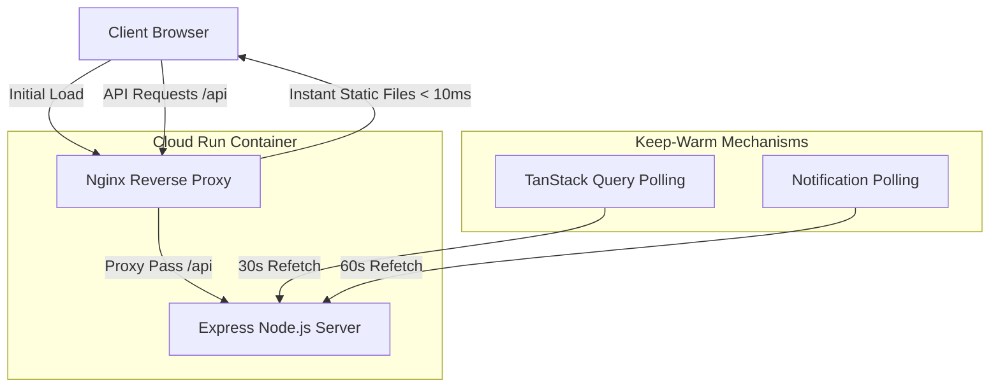

# Google Cloud Run Near-Zero Cold Start Architecture

This document describes in detail how the Atino Booking Webapp minimizes, bypasses, and mitigates cold start latency on Google Cloud Run—even when deployed with cost-saving **`--min-instances 0`**. 

Serverless architectures typically suffer from a "cold start" delay (often 3 to 10+ seconds) when an application scales down to 0 instances due to inactivity, and must spin up a new container to serve the next incoming request. By combining a high-performance reverse proxy, Ahead-of-Time (AOT) compiling, client-side session heartbeats, and browser retry-tolerance, this project achieves a **virtual 0-cold-start user experience**.

---

## The Cold Start Mitigation Matrix

Our architecture attacks cold start latency from multiple angles:



---

## Core Pillars of the Architecture

### 1. Dual-Server Container Design (Nginx + Node)
Rather than launching Node.js as the primary entry point, the container boots **Nginx** as the public-facing gateway on port `8080` (proxying traffic to Node on port `3001` for API requests).

* **Instant HTML Delivery:** Nginx is written in C and boots in **less than 10 milliseconds**. When a scaled-to-zero container receives a request, Nginx is instantly healthy and serves the index HTML, compiled CSS, and JS chunks from disk (`/usr/share/nginx/html`).
* **Visual Load Completeness:** To the user, the website loads and displays its UI skeleton almost instantaneously. The user is not staring at a spinning browser tab waiting for a cold start.

### 2. Ahead-of-Time (AOT) TS compilation
Booting TypeScript via execution engines like `tsx` or `ts-node` in production introduces severe latency because the engine must read, compile, and typecheck source code on startup.
* **Build Phase Compilation:** The project compiles TypeScript into lightweight ES modules/vanilla JS in the build container during `gcloud builds submit`:
  ```bash
  npm run server:typecheck && npx tsc -p tsconfig.server.json
  ```
* **Lean Runtime Execution:** At runtime, the startup script `start.sh` runs standard Node:
  ```bash
  exec node /app/dist-server/index.js
  ```
  This allows the Express server to boot and bind to port `3001` within a couple of hundred milliseconds of container launch.

### 3. Active Session Keep-Alives (TanStack Query)
Once the application is loaded, active browser sessions cooperate to keep the server awake. The frontend utilizes **TanStack Query** to periodically fetch data while the application is in use:
* **Capacity Polling:** The booking form (`BookingForm.tsx`) polls for warehouse capacities every 30 seconds (`refetchInterval: 30_000`).
* **Notification Polling:** The main notification bell (`useNotifications.ts`) polls for updates every 60 seconds (`refetchInterval: 60_000`).

While users are actively editing, reviewing, or receiving bookings, these background requests act as keep-alive signals. As long as at least one active user is online, the instance is kept warm, eliminating cold starts entirely during peak operational hours.

### 4. Client-Side Error and Retry Tolerance
As documented in the troubleshooting reference, there can be a brief window during cold starts where Nginx is fully booted, but the Express backend is still warming up.
* **Nginx 502 Bad Gateway:** If a request hits Nginx before Express binds to port `3001`, Nginx yields a `502`.
* **Automatic Silent Retries:** TanStack Query intercepts network failures and automatically retries requests using exponential backoff. The user never sees the error; the second retry succeeds silently within 1–2 seconds as Express completes its startup.

---

## Step-by-Step Optimization Guide for Absolute Zero Cold Starts

If you want to achieve a **100% absolute zero cold start** without scaling up your baseline budget, apply the following advanced strategies:

### A. Enable Cloud Run Startup CPU Boost
Google Cloud Run offers a **Startup CPU Boost** feature. When enabled, Cloud Run temporarily allocates extra CPU capacity during container startup (e.g., doubling it to 2 vCPUs) to speed up boot times, and then rolls it back once the container is healthy.
* **Implementation:** Add `--cpu-boost` to the `gcloud run deploy` command in `deploy.ps1`:
  ```powershell
  gcloud run deploy $SERVICE_NAME `
      --cpu-boost `
      # ... other arguments
  ```

### B. Deploy a Cost-Free Keep-Warm Cron (GCP Cloud Scheduler)
Since Google Cloud Run keeps containers warm for approximately 15 minutes after the last request, you can set up a lightweight cron job in **Google Cloud Scheduler** to ping your health endpoint `/api/health` every 14 minutes.
* **Cost:** Google Cloud Scheduler has a free tier of 3 free jobs per month.
* **Setup Command:**
  ```bash
  gcloud scheduler jobs create http keep-warm-atino-booking `
      --schedule="*/14 * * * *" `
      --uri="https://atino-booking-webapp-deuuuibkqletkkbrsmxd.a.run.app/api/health" `
      --http-method=GET `
      --location=asia-southeast1 `
      --time-zone="Asia/Ho_Chi_Minh"
  ```
This guarantees that at least one container is always kept warm 24/7 at **$0 additional hosting cost**.

### C. Configure `--min-instances 1` for High-Traffic Phases
If your business experiences critical hours (e.g., warehouse receiving between 08:00 AM and 06:00 PM ICT) where any cold start is unacceptable, you can scale the service natively.
* **Implementation:** Deploy with a minimum instance configuration:
  ```powershell
  gcloud run deploy $SERVICE_NAME `
      --min-instances 1 `
      # ... other arguments
  ```
> [!TIP]
> You can also use **Google Cloud Scheduler** to scale `min-instances` dynamically—setting it to `1` at 08:00 AM and dropping it to `0` at 06:00 PM to save costs.
