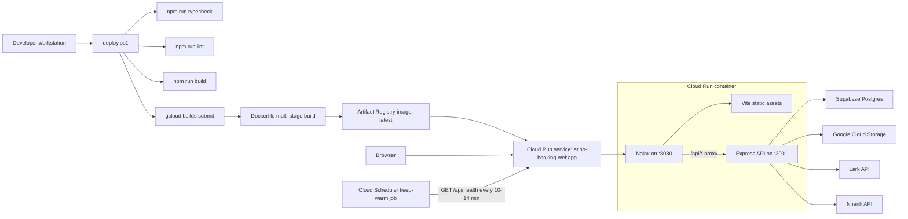
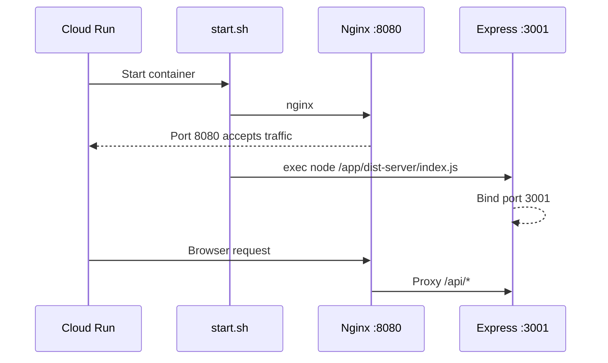

# GCP Deployment Architecture

This document describes how the Atino Booking Webapp is deployed on Google Cloud Platform, how the runtime is wired, and how the deployment keeps the public service effectively always warm while preserving the Cloud Run `--min-instances 0` cost model.

The important principle is:

> Cloud Run stays configured for scale-to-zero, but a low-frequency health ping keeps one revision warm continuously. Users get a zero-cold-start experience without paying for a permanently allocated minimum instance.

---

## Production Deployment Target

| Layer | Current value |
| --- | --- |
| GCP project | `atino-vietnam` |
| Region | `asia-southeast1` |
| Production Cloud Run service | `atino-booking-webapp` |
| Test Cloud Run service | `atino-booking-webapp-test` |
| Artifact Registry repo | `atino-docker` |
| Production image | `asia-southeast1-docker.pkg.dev/atino-vietnam/atino-docker/atino-booking-webapp:latest` |
| Test image | `asia-southeast1-docker.pkg.dev/atino-vietnam/atino-docker/atino-booking-webapp-test:latest` |
| Public container port | `8080` |
| Internal API port | `3001` |
| Cloud Run min instances | `0` |
| Cloud Run max instances | `3` production, `2` test |
| Runtime memory / CPU | `512Mi`, `1 vCPU` |
| Database / backend data plane | Supabase Postgres, accessed from Express with service-role key |
| File storage | Google Cloud Storage bucket `atino-media`, prefix `duy_booking_images` |

---

## High-Level Architecture



---

## Deploy Flow

Production deployment is controlled by `deploy.ps1`.

1. `npm run typecheck`
   Validates the frontend TypeScript project with `tsc --noEmit`.

2. `npm run lint`
   Blocks deployment if ESLint finds warnings or errors.

3. `npm run build`
   Builds the Vite frontend into `dist/`.

4. `.env.production` is generated temporarily
   `deploy.ps1` writes only the build-time `VITE_*` variables needed by Vite:

   ```env
   VITE_SUPABASE_URL=...
   VITE_SUPABASE_ANON_KEY=...
   VITE_STAFF_USERS=...
   ```

   The file is removed immediately after `gcloud builds submit`.

5. `gcloud builds submit`
   Cloud Build builds the Docker image from the local source tree and pushes it to Artifact Registry:

   ```powershell
   gcloud builds submit `
       --project atino-vietnam `
       --tag asia-southeast1-docker.pkg.dev/atino-vietnam/atino-docker/atino-booking-webapp:latest `
       .
   ```

6. `gcloud run deploy`
   Cloud Run is updated to the new image:

   ```powershell
   gcloud run deploy atino-booking-webapp `
       --project atino-vietnam `
       --region asia-southeast1 `
       --image asia-southeast1-docker.pkg.dev/atino-vietnam/atino-docker/atino-booking-webapp:latest `
       --platform managed `
       --allow-unauthenticated `
       --memory 512Mi `
       --cpu 1 `
       --min-instances 0 `
       --max-instances 3 `
       --timeout 60s `
       --port 8080 `
       --quiet `
       --set-env-vars "..."
   ```

7. Health check
   The script resolves the deployed service URL and calls:

   ```text
   GET /api/health
   ```

8. Image cleanup
   Production keeps the 3 most recent Artifact Registry digests and deletes older image digests.

---

## Docker Image Architecture

The Dockerfile uses a two-stage build.

### Stage 1: Builder

Base image:

```dockerfile
FROM node:20-slim AS builder
```

Builder responsibilities:

- Install dependencies with `npm ci`.
- Build the Vite frontend with `npm run build`.
- Typecheck and compile the Express server:

  ```bash
  npm run server:typecheck && npx tsc -p tsconfig.server.json
  ```

Generated artifacts:

- Frontend: `/app/dist`
- Backend: `/app/dist-server`

The compiled backend is plain JavaScript ESM. Production does not boot through `tsx`, `ts-node`, or a TypeScript runtime loader.

### Stage 2: Runtime

Base image:

```dockerfile
FROM node:20-slim AS runtime
```

Runtime responsibilities:

- Install Nginx.
- Install Node dependencies.
- Copy `/app/dist` into `/usr/share/nginx/html`.
- Copy `/app/dist-server` into `/app/dist-server`.
- Copy `nginx.conf` into `/etc/nginx/sites-available/default`.
- Start with `/start.sh`.

The runtime image exposes only:

```dockerfile
EXPOSE 8080
```

Cloud Run sends all public HTTP traffic to port `8080`.

---

## Runtime Process Model

`start.sh` starts two processes inside the same Cloud Run container:

```sh
nginx
exec node /app/dist-server/index.js
```

Nginx starts first and listens on `8080`. Express starts second and listens on `3001`.

The script uses `exec node ...` so the Node process becomes the foreground process. If Express exits, the container exits, and Cloud Run treats the revision as unhealthy instead of leaving a static-only container running.



---

## Nginx Routing

Nginx is the public entrypoint for both frontend and API traffic.

### Static frontend

The Vite build output is served from:

```text
/usr/share/nginx/html
```

SPA routes use history fallback:

```nginx
location / {
    try_files $uri $uri/ /index.html;
}
```

Hashed static assets are cached for one year:

```nginx
location ~* \.(js|css|png|jpg|jpeg|svg|ico|woff2?)$ {
    expires 1y;
    add_header Cache-Control "public, immutable";
}
```

### API proxy

All API calls are reverse-proxied to Express:

```nginx
location /api/ {
    proxy_pass http://localhost:3001;
    proxy_http_version 1.1;
    proxy_set_header Host $host;
    proxy_set_header X-Real-IP $remote_addr;
    proxy_set_header X-Forwarded-For $proxy_add_x_forwarded_for;
    client_max_body_size 15m;
}
```

The upload limit is set to `15m` to allow application-level 10 MB uploads plus multipart overhead.

---

## API Runtime Dependencies

Express is the backend data gateway. Browser code calls `/api/*`; Nginx forwards those requests to Express.

The backend uses these deployment-time environment variables:

| Variable | Purpose |
| --- | --- |
| `SUPABASE_URL` | Supabase project URL |
| `SUPABASE_SERVICE_ROLE_KEY` | Server-only Supabase access for protected database operations |
| `STAFF_USERS_B64` | Base64-encoded staff user JSON to avoid PowerShell/gcloud quote corruption |
| `GCS_SERVICE_ACCOUNT_JSON_B64` | Base64-encoded GCS service account JSON for production |
| `LARK_APP_ID` / `LARK_APP_SECRET` | Lark integration credentials |
| `NHANH_*` | Nhanh integration credentials |
| `NHANH_PRODUCT_*` | Optional separate Nhanh product credentials; falls back to `NHANH_*` values |

The GCS helper accepts both:

- `GCS_SERVICE_ACCOUNT_JSON_B64` for Cloud Run
- `GCS_SERVICE_ACCOUNT_JSON` for local fallback

Production uses base64 for JSON-like secrets because raw JSON passed through PowerShell and `gcloud run deploy --set-env-vars` can lose quotes.

---

## Why Cold Starts Are Avoided

The deployed service uses two separate mechanisms:

1. **Architectural cold-start masking**
   Nginx starts extremely quickly and can serve frontend assets as soon as Cloud Run starts the container. Express is already compiled JavaScript, so it avoids TypeScript runtime startup cost.

2. **Operational cold-start prevention**
   A Cloud Scheduler job pings `/api/health` more frequently than Cloud Run's idle retention window. That prevents the service from reaching zero during normal 24/7 operation, while the Cloud Run service itself still has `--min-instances 0`.

The second mechanism is what gives the practical "100% zero cold start" behavior. Without a keep-warm ping, `--min-instances 0` always permits a true cold start after enough idle time.

---

## Keep-Warm Architecture

Cloud Run may scale a service to zero after a period of inactivity. To keep the current revision warm without paying for a configured minimum instance, use Cloud Scheduler to call the lightweight health endpoint.

Recommended schedule:

```text
*/10 * * * *
```

or, if the service remains warm reliably in the project:

```text
*/14 * * * *
```

Target:

```text
GET https://<cloud-run-service-url>/api/health
```

Example:

```powershell
gcloud scheduler jobs create http keep-warm-atino-booking `
    --project atino-vietnam `
    --location asia-southeast1 `
    --schedule "*/10 * * * *" `
    --time-zone "Asia/Ho_Chi_Minh" `
    --uri "https://<cloud-run-service-url>/api/health" `
    --http-method GET
```

This is almost zero cost because:

- Cloud Scheduler has a small free tier that normally covers a single keep-warm job.
- `/api/health` is a tiny request with no database query required.
- Cloud Run remains `--min-instances 0`, so there is no explicit always-on minimum instance charge.
- The service only consumes tiny request/CPU/memory amounts for the health ping and whatever idle retention Cloud Run keeps after each ping.

Important distinction:

- `--min-instances 0` + no traffic = cheapest, but true cold starts can happen.
- `--min-instances 0` + Cloud Scheduler health ping = effectively always warm at tiny cost.

This project is designed around the second model.

---

## Startup CPU Boost

Cloud Run startup CPU boost can further reduce revision startup time after a deploy or after any rare true scale-from-zero event.

Add this flag to `gcloud run deploy` if it is not already enabled:

```powershell
--cpu-boost
```

CPU boost does not replace the keep-warm job. It only makes unavoidable starts faster. The keep-warm job is the mechanism that prevents user-facing cold starts.

---

## Test Deployment

`deploy_test.ps1` deploys an isolated Cloud Run service:

| Layer | Test value |
| --- | --- |
| Service | `atino-booking-webapp-test` |
| Image | `atino-booking-webapp-test:latest` |
| Max instances | `2` |
| Timeout | `3600s` |
| Production impact | None |

The test flow is the same shape as production:

1. Run TypeScript checks.
2. Build frontend.
3. Submit Docker build to Cloud Build.
4. Deploy to Cloud Run test service.
5. Call `/api/health`.
6. Clean up old Artifact Registry images.

Use test deployment for validation before production, but treat production environment variable encoding as the stricter reference because production uses `STAFF_USERS_B64` and `GCS_SERVICE_ACCOUNT_JSON_B64`.

---

## Failure Modes

### Nginx is up before Express

During a real cold start or immediately after deploy, Nginx can accept traffic before Express binds to `3001`.

Symptom:

```text
502 Bad Gateway
```

Meaning:

```text
Nginx is alive, but localhost:3001 is not ready yet.
```

Mitigation:

- Express is compiled ahead of time, so the window should be short.
- The deploy script waits briefly and then checks `/api/health`.
- Keep-warm traffic prevents normal users from hitting this path after idle scale-down.

### Malformed JSON environment variables

Raw JSON can be corrupted when passed through PowerShell and `gcloud run deploy --set-env-vars`.

Mitigation:

- Production sends staff users as `STAFF_USERS_B64`.
- Production sends GCS credentials as `GCS_SERVICE_ACCOUNT_JSON_B64`.
- The backend decodes those values at runtime.

### Stale frontend chunks

Nginx caches hashed assets for one year. This is correct for Vite chunk filenames, but a browser may occasionally hold an old page shell after deploy.

Mitigation:

- Hard refresh after a deploy if the browser behaves inconsistently.
- Vite-generated hashed asset names make new builds safe to cache aggressively.

---

## Deployment Checklist

Before production deploy:

- `gcloud auth login` has authenticated the deployer.
- `gcloud config set project atino-vietnam` is set or `deploy.ps1` project flags are used.
- `.env` contains `SUPABASE_SERVICE_ROLE_KEY`.
- `.env` contains `VITE_SUPABASE_URL`, `VITE_SUPABASE_ANON_KEY`, and `VITE_STAFF_USERS`.
- `.env` contains `GCS_SERVICE_ACCOUNT_JSON`.
- `.env` contains Lark and Nhanh credentials.
- Artifact Registry repo `atino-docker` exists in `asia-southeast1`.
- Cloud Run API, Cloud Build API, Artifact Registry API, Cloud Scheduler API, and Cloud Storage access are enabled.

After production deploy:

- `GET /api/health` returns `200`.
- Cloud Run logs show `Express server started`.
- Cloud Scheduler keep-warm job points at the current production URL.
- Artifact Registry cleanup kept the latest production digests.

---

## Summary

The deployment is a single Cloud Run service containing both the static frontend and the Express API. Nginx owns the public `8080` port, serves the Vite build, and proxies `/api/*` to compiled Express JavaScript on `3001`.

Cloud Build creates the image, Artifact Registry stores it, and `deploy.ps1` promotes it to Cloud Run with `--min-instances 0`. The zero-cold-start behavior comes from keeping that scale-to-zero service warm with a tiny Cloud Scheduler `/api/health` ping, not from paying for a permanent minimum Cloud Run instance.
